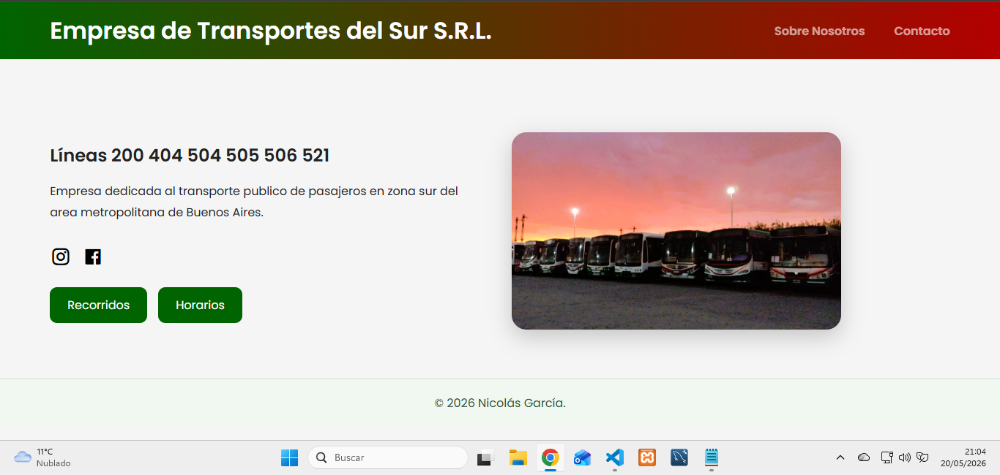
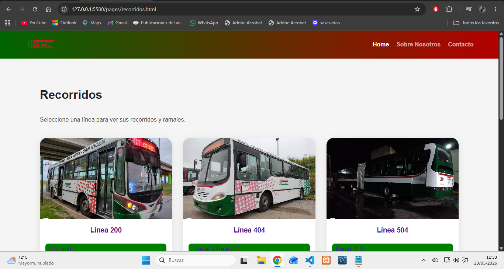
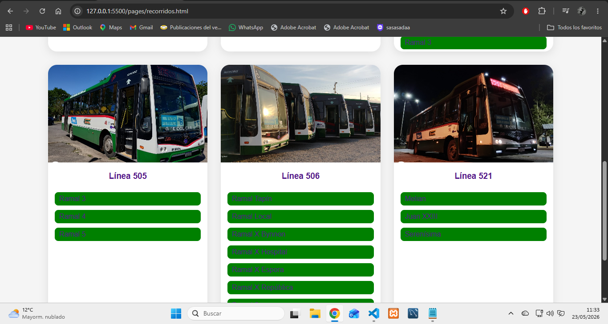
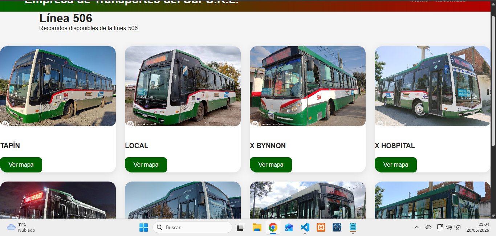
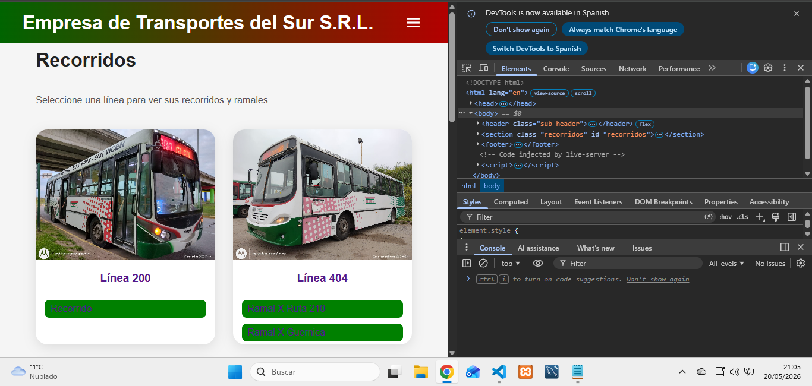
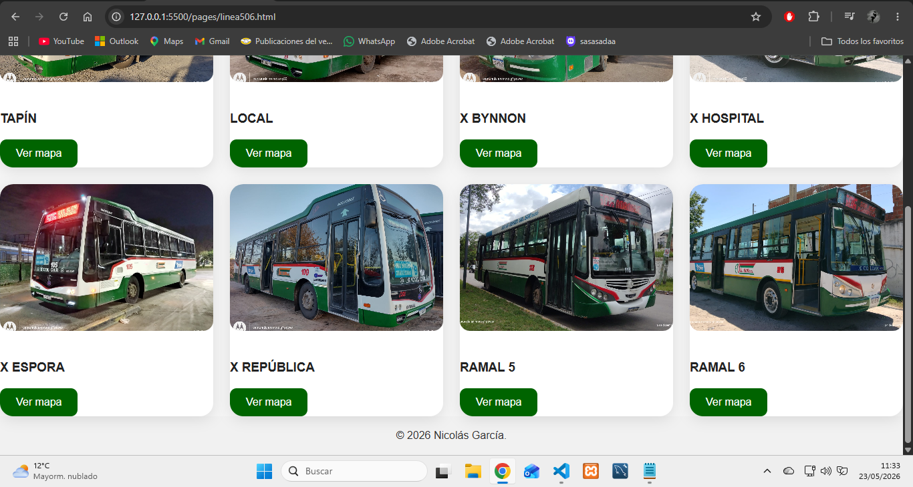

# Empresa de Transportes del Sur

Sitio web responsive desarrollado con HTML y CSS puro.

## Características

- Diseño responsive
- Menú mobile
- Navegación entre líneas y recorridos
- Organización por páginas
- Integración con Google Maps

## Tecnologías utilizadas

- HTML5
- CSS3
- Boxicons
- Remixicon

📸 Capturas

### Home


### Recorridos


### Línea 404


### Línea 506


### Responsive




## 📁 Estructura del proyecto

```txt
/assets
  ├── /img
  └── /screenshots

/pages
  ├── linea200.html
  ├── linea404.html
  ├── linea504.html
  ├── linea505.html
  ├── linea506.html
  ├── linea521.html
  └── recorridos.html

index.html
README.md
style.css

## 🌐 Demo

https://empresa-de-transportes-del-sur.onrender.com/

## 👨‍💻 Autor
Nicolas Garcia
🔗 GitHub: [Nicolas-1990](https://github.com/Nicolas-1990)
📧 Email: nicolas_garcia1990@hotmail.com